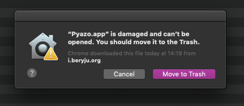

You might see this error upon downloading the macOS client:

This happens because `Pyazo.app` is modified server-side to embed your server URL. To fix this issue, execute this command in `Terminal.app`:

`xattr -rc Pyazo.app`